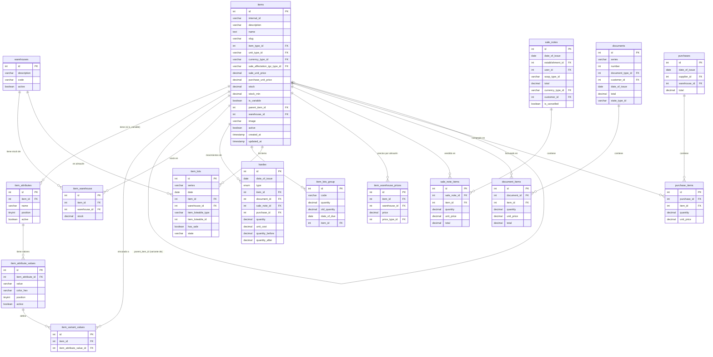

# ERD: Sistema de Variantes ERP

```mermaid
erDiagram
    %% ── PRODUCTOS Y VARIANTES ─────────────────────────────────────────
    items {
        int id PK
        varchar internal_id
        varchar description
        text name
        varchar slug
        int item_type_id FK
        varchar unit_type_id FK
        varchar currency_type_id FK
        varchar sale_affectation_igv_type_id FK
        decimal sale_unit_price
        decimal purchase_unit_price
        decimal stock
        decimal stock_min
        boolean is_variable
        int parent_item_id FK
        int warehouse_id FK
        varchar image
        boolean active
        timestamp created_at
        timestamp updated_at
    }

    item_attributes {
        int id PK
        int item_id FK
        varchar name
        tinyint position
        boolean active
    }

    item_attribute_values {
        int id PK
        int item_attribute_id FK
        varchar value
        varchar color_hex
        tinyint position
        boolean active
    }

    item_variant_values {
        int id PK
        int item_id FK
        int item_attribute_value_id FK
    }

    %% ── INVENTARIO ────────────────────────────────────────────────────
    item_warehouse {
        int id PK
        int item_id FK
        int warehouse_id FK
        decimal stock
    }

    kardex {
        int id PK
        date date_of_issue
        enum type
        int item_id FK
        int document_id FK
        int sale_note_id FK
        int purchase_id FK
        decimal quantity
        decimal unit_cost
        decimal quantity_before
        decimal quantity_after
    }

    item_lots_group {
        int id PK
        varchar code
        decimal quantity
        decimal old_quantity
        date date_of_due
        int item_id FK
    }

    item_lots {
        int id PK
        varchar series
        date date
        int item_id FK
        int warehouse_id FK
        varchar item_loteable_type
        int item_loteable_id
        boolean has_sale
        varchar state
    }

    %% ── ALMACENES ─────────────────────────────────────────────────────
    warehouses {
        int id PK
        varchar description
        varchar code
        boolean active
    }

    %% ── PRECIOS POR VARIANTE ──────────────────────────────────────────
    item_warehouse_prices {
        int id PK
        int item_id FK
        int warehouse_id FK
        decimal price
        int price_type_id FK
    }

    %% ── VENTAS ────────────────────────────────────────────────────────
    sale_notes {
        int id PK
        date date_of_issue
        int establishment_id FK
        int user_id FK
        varchar soap_type_id
        decimal total
        varchar currency_type_id FK
        int customer_id FK
        boolean is_cancelled
    }

    sale_note_items {
        int id PK
        int sale_note_id FK
        int item_id FK
        decimal quantity
        decimal unit_price
        decimal total
    }

    documents {
        int id PK
        varchar series
        int number
        int document_type_id FK
        int customer_id FK
        date date_of_issue
        decimal total
        varchar state_type_id
    }

    document_items {
        int id PK
        int document_id FK
        int item_id FK
        decimal quantity
        decimal unit_price
        decimal total
    }

    %% ── COMPRAS ───────────────────────────────────────────────────────
    purchases {
        int id PK
        date date_of_issue
        int supplier_id FK
        int warehouse_id FK
        decimal total
    }

    purchase_items {
        int id PK
        int purchase_id FK
        int item_id FK
        decimal quantity
        decimal unit_price
    }

    %% ── RELACIONES ────────────────────────────────────────────────────
    items ||--o{ item_attributes : "tiene (si is_variable)"
    item_attributes ||--o{ item_attribute_values : "tiene valores"
    items ||--o{ item_variant_values : "vinculado a"
    item_attribute_values ||--o{ item_variant_values : "define"
    items ||--o| items : "parent_item_id (variante de)"
    items ||--o{ item_warehouse : "stock en"
    warehouses ||--o{ item_warehouse : "tiene stock de"
    items ||--o{ kardex : "movimientos de"
    items ||--o{ item_lots_group : "lotes de"
    items ||--o{ item_lots : "lot items"
    warehouses ||--o{ item_lots : "en almacén"
    items ||--o{ item_warehouse_prices : "precios por almacén"
    items ||--o{ sale_note_items : "vendido en"
    sale_notes ||--o{ sale_note_items : "contiene"
    items ||--o{ document_items : "facturado en"
    documents ||--o{ document_items : "contiene"
    items ||--o{ purchase_items : "comprado en"
    purchases ||--o{ purchase_items : "contiene"
```
