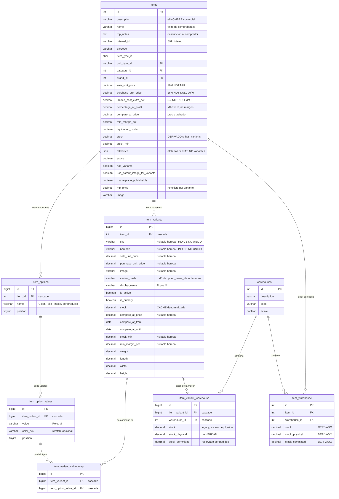
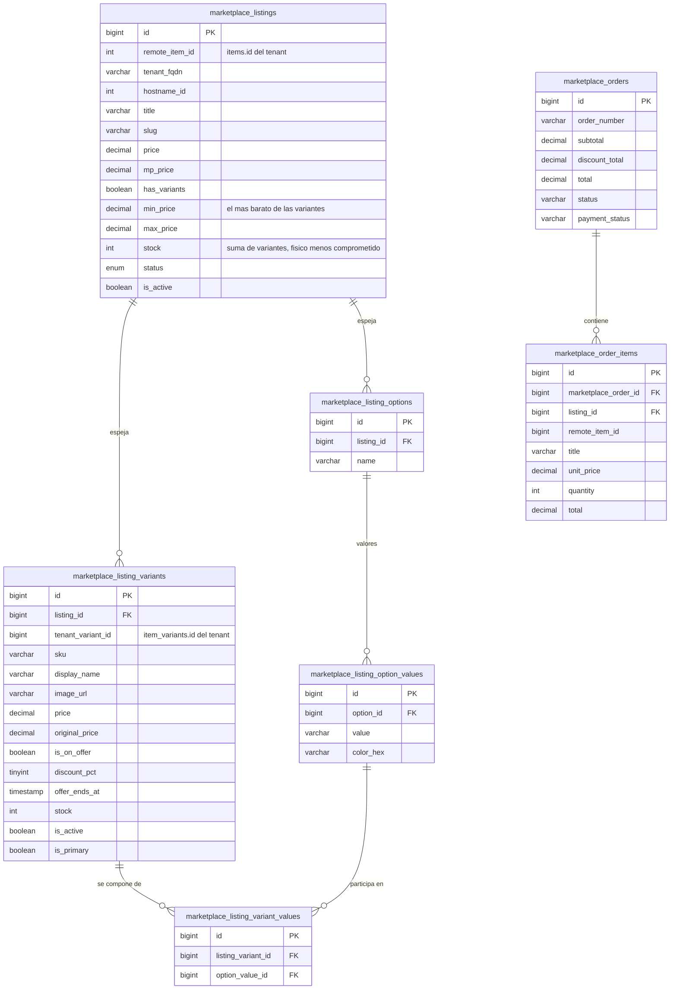

# ERD: Sistema de Variantes

> Verificado contra el esquema real de un tenant (`SHOW COLUMNS` / `SHOW INDEX` /
> `information_schema`) el **2026-10-07**. Reemplaza por completo la versión anterior
> de este archivo, que describía tablas que nunca se construyeron
> (`item_attributes`, `item_attribute_values`, `item_variant_values`,
> `items.is_variable`, `items.parent_item_id`) y modelaba la variante como una fila
> de `items` con padre — lo contrario de lo que existe.
>
> Multi-tenant: DB-per-tenant (hyn/tenancy). **No hay columna `tenant_id`** en
> ninguna de estas tablas. Las `marketplace_*` viven en la base `system`, el resto
> en la base de cada tienda.

## 1. Catálogo y variantes (base tenant)



### Índices y restricciones reales

```
item_variants:
  UNIQUE (item_id, variant_hash)   uq_item_variant_hash   <- impide duplicar la combinación
  INDEX  (item_id) (is_active) (sku) (barcode) (item_id, is_primary)
  OJO: sku y barcode NO son únicos en BD. La unicidad se valida en
       ItemVariantController::update() con Rule::unique(...)->where('item_id', ...),
       es decir SOLO dentro del mismo producto y de forma NO atómica.

item_options:            UNIQUE (item_id, name)              uq_item_option_name
item_option_values:      UNIQUE (item_option_id, value)       uq_option_value
item_variant_value_map:  UNIQUE (item_variant_id, item_option_value_id)
item_variant_warehouse:  UNIQUE (item_variant_id, warehouse_id)
```

### Herencia padre → variante

Los campos nullable de `item_variants` significan «usa el del producto». La regla
está centralizada en `ItemVariant::inherited(string $field)` y usa `??`, **no `?:`**:
con `0` como valor propio (un peso, un margen mínimo, un precio de obsequio) el `?:`
cae al padre en silencio.

Campos con herencia: `sale_unit_price`, `purchase_unit_price`, `sku`, `barcode`,
`image`, `compare_at_price`, `stock_min`, `min_margin_pct`.

**No** tienen equivalente por variante: `mp_price`, los precios mayoristas de
`item_unit_types`, los precios de `item_warehouse_prices`, ni `category_id`.

### Jerarquía del stock — una sola verdad

```
item_variant_warehouse.stock_physical     <- LA VERDAD (si has_variants)
        |  ItemVariantService::computeStock()   (suma solo variantes ACTIVAS)
        |  ItemVariantService::propagateStock()
        v
item_warehouse.stock / .stock_physical    <- DERIVADO, se reescribe entero
        v
items.stock                               <- DERIVADO

item_variants.stock             <- CACHE: suma de sus almacenes
item_variant_warehouse.stock    <- LEGACY: espejo de stock_physical
```

`stock_available` no es columna: se computa `max(0, stock_physical - stock_committed)`.
Lo que se publica al comprador es el **disponible**, no el físico.

**Regla de oro:** con `has_variants = true` NUNCA se escribe `item_warehouse.stock`
ni `items.stock` directo — `propagateStock()` los reescribe desde las variantes y
borraría el cambio. El único escritor legítimo es
`ItemVariantService::updateVariantStock()`. Ver la skill `ebaemy-stock-flow`.

## 2. Espejo en el marketplace (base system)



El espejo del catálogo es completo. **`marketplace_order_items` no tiene columna de
variante**, así que la línea del pedido central no sabe qué variante se compró.

## 3. La frontera: dónde la variante deja de existir

Las **únicas** tablas con dimensión de variante:

| Tabla | Columna | Base |
|---|---|---|
| `item_variants` · `item_variant_value_map` · `item_variant_warehouse` | — | tenant |
| `items` | `has_variants`, `use_parent_image_for_variants` | tenant |
| `logistic_order_items` | `variant_id` → FK `ON DELETE SET NULL` | tenant |
| `purchase_order_items` | `variant_id` → FK `ON DELETE SET NULL` | tenant |
| `marketplace_products` | `item_variant_id` (mapeo Saga) | tenant |
| `orders` | `items[].variant_id` **dentro del JSON**, sin FK posible | tenant |
| `marketplace_listing_variants` · `marketplace_listing_variant_values` | — | system |

Tablas que **no** la tienen (toda línea apunta sólo a `item_id`):

```
document_items          factura / boleta   <- item_id + item (json con lista blanca de claves)
sale_note_items         nota de venta
quotation_items         cotizacion
purchase_items          la compra (recepcion real)
devolution_items        devolucion
dispatch_items          guia de remision
guide_items
kardex                  kardex contable
inventory_kardex        kardex de inventario
inventories             movimientos y ajustes
weighted_average_costs  costo promedio ponderado
discount_rules          promociones (apply_item_id / apply_category_id)
marketplace_order_items (base system)
```

## 4. Cuatro cosas se llaman «atributo»

| # | Dónde | Qué es | Estado |
|---|---|---|---|
| 1 | `item_options` + `item_option_values` + `item_variant_value_map` | **El sistema real de variantes** | Vivo |
| 2 | `items.attributes` (json) + `attribute_types` | Atributos del catálogo 55 de SUNAT para el XML. Pestaña «Atributos» del formulario | Vivo, **sin relación con variantes** |
| 3 | `item_color`, `item_size`, `cat_colors_items`, `cat_item_size` | Variantes del upstream Pro8/Pro9: etiquetas sin stock ni precio | **0 filas, código vivo.** El filtro «por variantes» de `InventoryReviewController` (`getStockByVariantsInventoryReview`) consulta ESTE sistema |
| 4 | La versión anterior de este archivo | `item_attributes`, `item_variant_values`, `items.is_variable`, `items.parent_item_id` | **Nunca existió** |

## 5. Identificación de una variante

`variant_hash = md5(implode(',', sort($option_value_ids)))`
(`ItemVariant::buildHash()`), con `UNIQUE(item_id, variant_hash)`.

Consecuencia que hay que tener presente al tocar las opciones: el hash depende de
los **IDs**, no del texto. `ItemVariantController::saveOptions()` sincroniza in-place
reusando los IDs a propósito — si borrase y recreara los valores, todas las variantes
quedarían obsoletas y se recrearían vacías (sin imagen, stock 0, ocultas en el
marketplace). La cara B es que **renombrar** un valor conserva el hash: cambiar
«Rojo» por «Verde» convierte «Rojo / M» en «Verde / M» quedándose con su stock,
su imagen y su precio.
